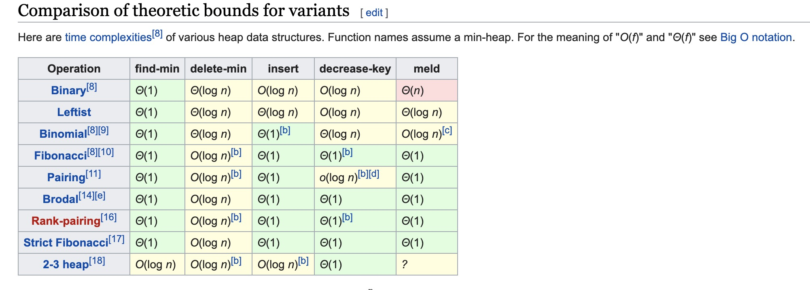

[TOC]

学习笔记

#### 数据结构

##### HashMap&HashSet

| 方法或字段                                                   | 注释                                                   |
| ------------------------------------------------------------ | ------------------------------------------------------ |
| <span style="color:red">DEFAULT_INITIAL_CAPACITY</span>      | The default initial capacity - MUST be a power of two. |
| <span style="color:red">MAXIMUM_CAPACITY</span>              |                                                        |
| <span style="color:red">DEFAULT_LOAD_FACTOR</span>           |                                                        |
| <span style="color:red">TREEIFY_THRESHOLD</span>             |                                                        |
| <span style="color:red">UNTREEIFY_THRESHOLD</span>           |                                                        |
| <span style="color:red">MIN_TREEIFY_CAPACITY</span>          |                                                        |
| <span style="color:green">Node<K,V> implements Map.Entry<K,V></span> | Basic hash bin node                                    |
| <span style="color:green">TreeNode<K,V> extends LinkedHashMap.Entry<K,V></span> | red-black Tree bins                                    |
| <span style="color:blue">V put(K key, V value)</span>        |                                                        |
| <span style="color:blue">V get(Object key)</span>            |                                                        |


##### 树

树的定义是递归的，树T是一个非空数据元素的有限集合，其中有且仅有一个特定元素称为树T的根，剩余的元素（若有的话）可被划分为 m 个互不相交的集合 T1，T2，... ，Tm，而每个集合又都是树，称为T的子树( Subtree ) 

> 概念

| 概念                          | 解释                                                         | 概念                           | 解释                      |
| ----------------------------- | ------------------------------------------------------------ | ------------------------------ | ------------------------- |
| 根节点                        |                                                              | 叶子节点                       |                           |
| 结点                          | 树中的一个数据元素                                           |                                |                           |
| 结点的度                      | 任一结点子树的数目，记作 d(v)                                | 树的度                         | 树中结点度的最大值。K叉树 |
| 树的层次(level)               | 根结点定义为第1层，根的儿子定义为第2层，...，依次类推。记作 L(v) |                                |                           |
| 树的深度(depth)[从root往下看] | 所有结点层次的最大值(最长路径上的结点数)                     | 树的高度(height)[从树叶往上看] | 等于最长路径              |
| 路径                          | 树中的k个结点n1,n2,...,nk，满足 ni是 ni+1的双亲，称n1到nk有一条路径 | 最长路径                       | 分支数=路径上结点个数-1   |

> 数据的存储

链表

> 树的分类

- N叉树

- 二叉树
  - 满二叉树
    - 
  - 完全二叉树
    - 
  - 二叉搜索树


##### 二叉树

树的度为2的树称为二叉树

> 二叉树的存储

链表、数组(完全二叉树)

###### 二叉树

```python
# 链表存储 二叉树的节点定义
class TreeNode:
     def __init__(self, x):
         self.val = x
         self.left = None
         self.right = None
```


###### 二叉搜索树

>  左子树小于根节点，右子树都要大于根节点，且左右子树具有相同的特征


###### 堆

> 可以在O(1)的时间复杂度内在一堆数中找到最大值或者最小值的数据结构
>
> 分为大顶堆、小顶堆

堆的常见操作：

- Find-max(min): O(1)
- Delete-max(min):O(log n)
- Insert(create): O(log n) or O(1)

不同堆的实现比较：



二叉堆的性质

> 通过完全二叉树**(可以使用数组来存储)**来实现，(不是二叉搜索树)
>
> 它是堆的一种常见且简单的实现，但并不是最优的实现，请见[维基百科](<https://en.wikipedia.org/wiki/Heap_(data_structure)>)

性质：

- 是一棵完全二叉树
- 树中任意结点的值总是>=子节点的值

二叉堆的实现

- 可以直接用数组存储二叉堆
- 根结点(对顶元素)在数组中的索引为0，则父子结点的位置关系如下：
  - i left 2*i+1
  - i right 2*i+2
  - i father floor((i-1)/2)
- Insert 
  - 新元素一律先插入到堆的尾部
  - heapify_up 依次向上调整整个堆的结构
    - (max-heap) 与其父结点比较，如果大于其父结点，那么对换二者，直到根结点或者小于父结点
    - (min-heap) 与其父结点比较，如果小于其父结点，那么对换二者，直到根结点或者大于父结点
- Delete
  - 将堆尾元素替换到顶部
  - heapify_down 依次从向下调整整个堆的结构
    - (max-heap) 从其两个子结点中找到最大的结点，对换二者，直到叶子结点或者比两个子结点都大
    - (min-heap) 从其两个子结点中找到最小的结点，对换二者，直到叶子结点或者比两个子结点都小