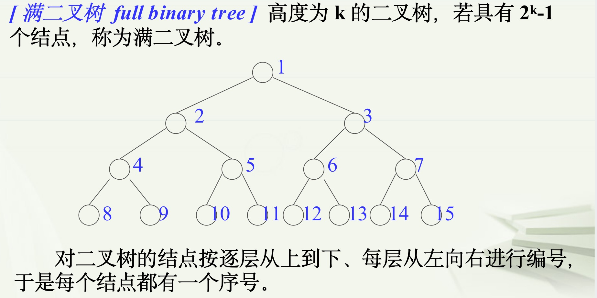
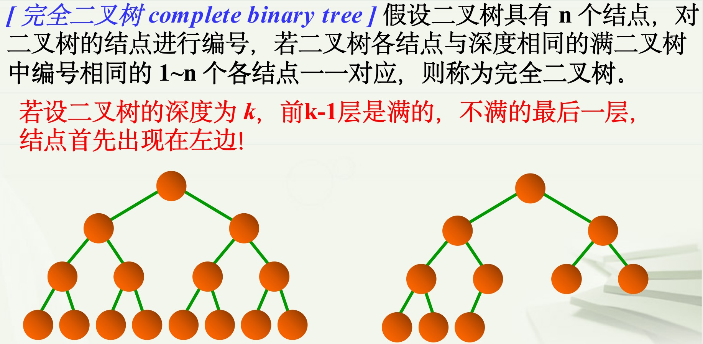

[TOC]

学习笔记

#### 数据结构

##### HashMap&HashSet


##### 树

树的定义是递归的，树T是一个非空数据元素的有限集合，其中有且仅有一个特定元素称为树T的根，剩余的元素（若有的话）可被划分为 m 个互不相交的集合 T1，T2，... ，Tm，而每个集合又都是树，称为T的子树( Subtree ) 

> 概念

| 概念            | 解释                                                         | 概念             | 解释                      |
| --------------- | ------------------------------------------------------------ | ---------------- | ------------------------- |
| 根节点          |                                                              | 叶子节点         |                           |
| 结点            | 树中的一个数据元素                                           |                  |                           |
| 结点的度        | 任一结点子树的数目，记作 d(v)                                | 树的度           | 树中结点度的最大值。K叉树 |
| 树的层次(level) | 根结点定义为第1层，根的儿子定义为第2层，...，依次类推。记作 L(v) |                  |                           |
| 树的深度(depth) | 所有结点层次的最大值                                         | 树的高度(height) |                           |
| 路径            | 树中的k个结点n1,n2,...,nk，满足 ni是 ni+1的双亲，称n1到nk有一条路径 | 最长路径         | 分支数=路径上结点个数-1   |

> 数据的存储

链表

> 树的分类

- 森林
- N叉树

- 二叉树
  - 满二叉树
    - 
  - 完全二叉树
    - 
  - 二叉搜索树


##### 二叉树

树的度为2的树称为二叉树

> 二叉树的存储

链表、数组(完全二叉树)

###### 二叉树

```python
# 链表存储 二叉树的节点定义
class TreeNode:
     def __init__(self, x):
         self.val = x
         self.left = None
         self.right = None
```


###### 二叉搜索树


###### 堆


