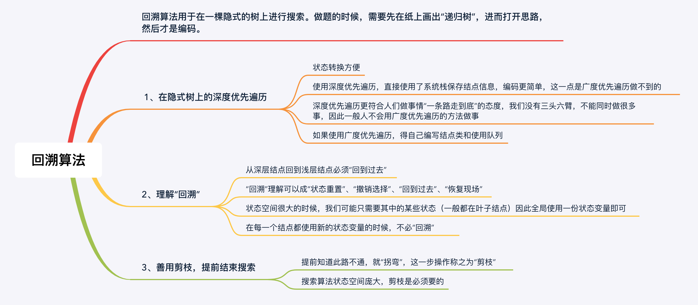

学习笔记

##### 递归

> 解题思路：
>
> - 不要人肉进行递归（最大误区）  
> - 找到最近最简方法，将其拆解成可重复解决的问题（重复子问题）  这也是核心思想
> - 数学归纳法思维

```python
def recursion(level, param1, param2, ...): 
    # recursion terminator 递归终结条件
    if level > MAX_LEVEL: 
	   process_result 
	   return 
    # process logic in current level 处理当前层逻辑
    process(level, data...) 
    # drill down 下探到下一层
    self.recursion(level + 1, p1, ...) 
    # reverse the current level status if needed 清理当前层
```


##### 分治

> 核心思想：看到问题的重复性，找到重复子问题
>
> 一个大问题 可以分解成多个子问题，将子问题的结果组合起来形成大问题的结果

```python
def divide_conquer(problem, param1, param2, ...): 
	# recursion terminator 
	if problem is None: 
 		print_result 
		return
	# prepare data 
 	data = prepare_data(problem) 
 	subproblems = split_problem(problem, data) 
	# conquer subproblems 
 	subresult1 = self.divide_conquer(subproblems[0], p1, ...) 
 	subresult2 = self.divide_conquer(subproblems[1], p1, ...) 
 	subresult3 = self.divide_conquer(subproblems[2], p1, ...) 
	...
	# process and generate the final result 
	result = process_result(subresult1, subresult2, subresult3, …) 
	# revert the current level states
```

##### 回溯

> “回溯”算法也叫“回溯搜索”算法，主要用于在一个庞大的空间里搜索我们所需要的问题的解
>
> “回溯”指的是“状态重置”，可以理解为“回到过去”、“恢复现场”，是在编码的过程中，是为了节约空间而使用的一种技巧。而回溯其实是“深度优先遍历”特有的一种现象。之所以是“深度优先遍历”，是因为我们要解决的问题通常是在一棵树上完成的，在这棵树上搜索需要的答案，一般使用深度优先遍历。
>

[Leetcode上的一个超好的题解](<https://leetcode-cn.com/problems/permutations/solution/hui-su-suan-fa-python-dai-ma-java-dai-ma-by-liweiw/>)



回溯题目列表

| 题目                                                         | 提示                                                         | 是否完成 |
| ------------------------------------------------------------ | ------------------------------------------------------------ | -------- |
| [46. 全排列](https://leetcode-cn.com/problems/permutations/) | “全排列”就是一个非常经典的“回溯”算法的应用                   | ✅        |
| [47. 全排列 II](https://leetcode-cn.com/problems/permutations-ii/) | 思考一下，为什么造成了重复，如何在搜索之前就判断这一支会产生重复，从而“剪枝”。<br />利用有序数组的特性(就和之前做[15. 三数之和](https://leetcode-cn.com/problems/3sum/)那样)：连续两个一样的值那么他后续的排列肯定是和前一个值的排列是一样的<br /><br />但是这道题，需要我们慎重使用这个特性，因为还需要满足一个条件：判重的同时，还要保证当前所处的level，即前后两个值level相同的情况才可以使用这个特性<br /><br />那么怎么保证前后两个值level相同呢？可以维护一个全局的状态数组，初始都是0(表示不处于任何level)，和数组长度一样，记录每一个值的level，在dfs的时候，动态改变这个状态数组，当前值参与排列的时候，把对应位置的level设置为当前的level，把当前的值和前一个值进行对比，同时当前的level和前一个值的level进行对比，都一样的话，表明是同一个值在当前level被排列了两次，那么在此处剪枝，否则继续<br /><br />同时，我们会发现，只要我们知道了前一个相同的值是否还在参与排列，就足够了：同level的值参与排列的时候会自动被revert state(回溯，即状态重置)，只要前一个相同值没有在参与排列，那么说明**此时此刻**当前值和前一个值实际上就是处于同一个level，否则的话，说明**此时此刻**当前值和前一个值实际上就是不处于同一个level。那么也就是说我们可以维护一个0 1的状态数组，保证某元素**当前**有没有被使用就可以了 | ✅        |
| [17 .电话号码的字母组合](https://leetcode-cn.com/problems/letter-combinations-of-a-phone-number/) |                                                              |          |
| [22. 括号生成](https://leetcode-cn.com/problems/generate-parentheses/) | 这是字符串问题，没有显式回溯的过程。这道题广度优先遍历也很好写，可以通过这个问题理解一下为什么回溯算法都是深度优先遍历，并且都用递归来写。 |          |
| [39. 组合总和](https://leetcode-cn.com/problems/combination-sum/) | 使用题目给的示例，画图分析。                                 |          |
| [40. 组合总和 II](https://leetcode-cn.com/problems/combination-sum-ii/) |                                                              |          |
| [51. N皇后](https://leetcode-cn.com/problems/n-queens/)      | 其实就是全排列问题，注意设计清楚状态变量。                   |          |
| [60. 第k个排列](https://leetcode-cn.com/problems/permutation-sequence/) | 利用了剪枝的思想，减去了大量枝叶，直接来到需要的叶子结点。   |          |
| [77. 组合](https://leetcode-cn.com/problems/combinations/)   | 组合问题按顺序找，就不会重复。并且举一个中等规模的例子，找到如何剪枝，这道题思想不难，难在编码。 |          |
| [78. 子集](https://leetcode-cn.com/problems/subsets/)        | 为数不多的，解不在叶子结点上的回溯搜索问题。解法比较多，注意对比。 |          |
| [90. 子集 II](https://leetcode-cn.com/problems/subsets-ii/)  | 剪枝技巧同 47 题、39 题、40 题。                             |          |
| [93. 复原IP地址](https://leetcode-cn.com/problems/restore-ip-addresses/) |                                                              |          |
| [784. 字母大小写全排列](https://leetcode-cn.com/problems/letter-case-permutation/) |                                                              |          |


##### 动态规划

动态规划（英语：Dynamic programming，简称 DP）是一种在数学、管理科学、计算机科学、经济学和生物信息学中使用的，通过把原问题分解为相对简单的子问题的方式求解复杂问题的方法。

动态规划常常适用于有重叠子问题和最优子结构性质的问题，动态规划方法所耗时间往往远少于朴素解法。

动态规划背后的基本思想非常简单。大致上，若要解一个给定问题，我们需要解其不同部分（即子问题），再根据子问题的解以得出原问题的解。动态规划往往用于优化递归问题，例如斐波那契数列，如果运用递归的方式来求解会重复计算很多相同的子问题，利用动态规划的思想可以减少计算量。

通常许多子问题非常相似，为此动态规划法试图仅仅解决每个子问题一次，具有天然剪枝的功能，从而减少计算量：一旦某个给定子问题的解已经算出，则将其记忆化存储，以便下次需要同一个子问题解之时直接查表。这种做法在重复子问题的数目关于输入的规模呈指数增长时特别有用。


##### 总结

分治是将一个大的问题，分解成若干个子问题，分别求解，最终再将子问题的解合并到一起，形成大问题的解

回溯是在一个很大的空间里搜索我们所需要的问题的解，其时间复杂度一般都是很高的，所以在寻找解的过程中，如果能够提前知道某一条分支不能搜索到满意的答案，就可以提前结束本次搜索，这就是**剪枝**(回溯算法中，尽量使用空间换时间的方式来降低时间复杂度)

递归是分治和回溯的实现方式。是一种自上而下的编程模式

分治和回溯是两种编程思想，递归是这两种思想的具体实现方式

也有一些简单的例子，没有上升到分治和回溯的思想高度，直接用一个简单的递归即可实现

(动态规划则反其道而行之，它是一种自下而上的编程思想..具体后面继续)